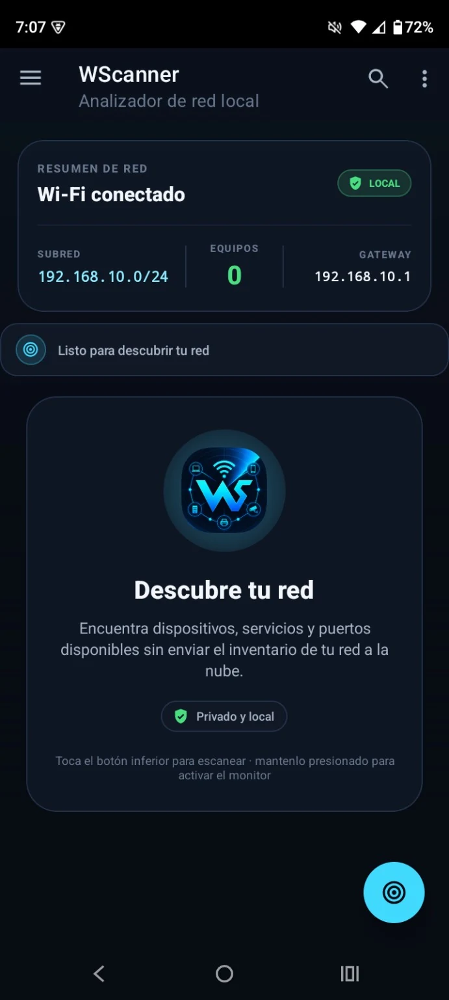
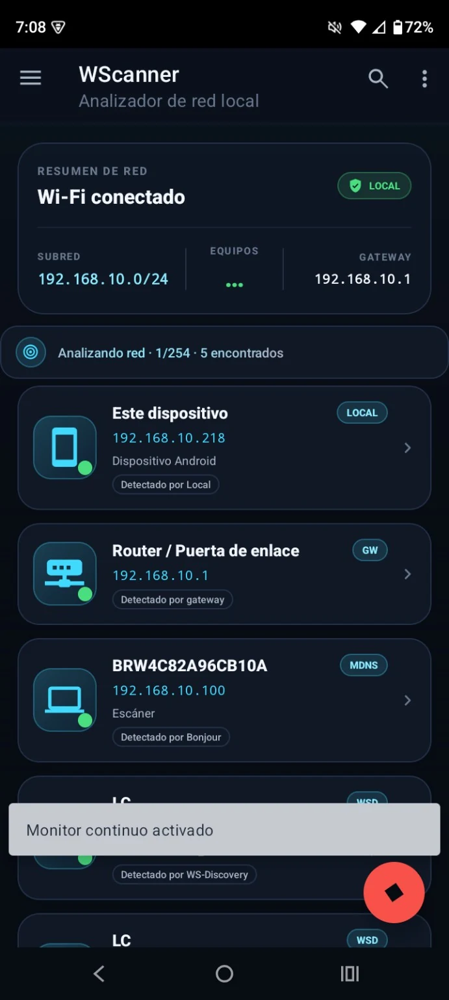
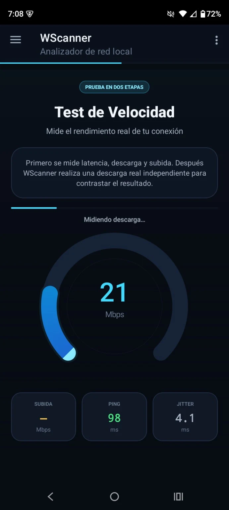
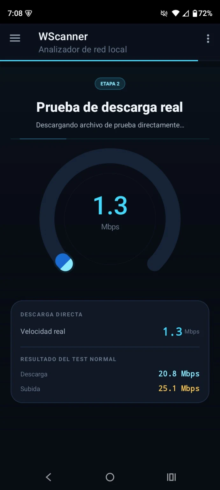

<p align="center">
  
</p>

# WScanner

Escáner e inventario de red local para Android. El descubrimiento de dispositivos funciona dentro de la LAN y no necesita APIs, cuentas, servicios cloud ni consultas a Internet para detectar equipos.

## Características

- **Inventario persistente por red:** un reescaneo no vacía la lista ni marca equipos como ausentes mientras el ciclo sigue en curso. Un dispositivo pasa a estado atenuado/offline solo cuando termina el barrido completo sin volver a observarlo.
- **Monitor continuo estable:** la pulsación larga sobre el botón de escaneo repite ciclos conservando el último estado confirmado de cada equipo entre ciclos; un inicio manual durante la pausa cancela el ciclo programado para evitar escaneos solapados.
- **Descubrimiento multicapa local:** ICMP, fallback TCP, mDNS/DNS-SD, SSDP/UPnP, WS-Discovery/ONVIF, SNMP v2c de mejor esfuerzo, DNS inverso, NetBIOS/NBNS, caché de vecinos, puertos, HTTP, TLS, SSH, FTP y RTSP.
- **Equipos que bloquean ping:** mDNS, SSDP, WS-Discovery, SNMP o un servicio TCP abierto pueden incorporar un dispositivo aunque no responda ICMP.
- **Subred real:** usa la IPv4, prefijo y gateway reportados por Android; no asume siempre `/24`.
- **Sockets ligados a la LAN seleccionada:** cuando Android expone el `Network` WiFi/Ethernet, los probes TCP y las peticiones HTTP locales se fijan a esa red para evitar rutas incorrectas en equipos con varias conexiones.
- **Identidad por evidencias locales:** combina nombres, tipos, servicios y metadatos autoanunciados por los propios dispositivos sin depender de un diccionario remoto.
- **mDNS estructurado:** conserva tipos DNS-SD y registros TXT autoanunciados para recuperar, cuando existen, nombre amigable, modelo, fabricante, plataforma y MAC publicada por el propio servicio.
- **UPnP estructurado:** conserva `friendlyName`, fabricante, modelo, tipo UPnP y `SERVER`; el software del servidor web no se usa como nombre del equipo.
- **WS-Discovery/ONVIF:** descubre cámaras, impresoras, escáneres y dispositivos WSD mediante UDP 3702.
- **SNMP opcional:** consulta únicamente `sysName.0` y `sysDescr.0` con la comunidad convencional de lectura `public`; nunca es requisito para detectar un host.
- **NetBIOS enriquecido:** NBSTAT puede aportar nombre, grupo de trabajo y Unit ID/MAC cuando el equipo lo publica, permitiendo enriquecer el fabricante con la OUI local sin depender de Internet.
- **Fingerprint local adicional:** títulos/realm HTTP, certificado TLS local y banners SSH/FTP/RTSP como señales complementarias.
- **Clasificación conservadora:** un puerto RTSP abierto se clasifica como dispositivo RTSP/video; solo señales explícitas como ONVIF o `NetworkVideoTransmitter` elevan la categoría a cámara.
- **MAC/OUI opcional:** la base OUI embebida solo enriquece resultados cuando Android realmente permite obtener una MAC.
- **Fusión estable:** una señal genérica posterior no reemplaza una identidad específica de mejor calidad.
- **Cancelación real:** detener el escaneo invalida la generación activa y evita publicar resultados obsoletos.
- **Aislamiento entre ciclos:** callbacks tardíos de un escaneo cancelado se descartan y no pueden marcar equipos como vistos dentro del ciclo siguiente.
- **Speed Test en dos etapas:** primero mide latencia, jitter, descarga multistream y subida contra un backend de prueba con fallback transparente; después cambia a una segunda pantalla y ejecuta una descarga HTTP convencional para contrastar el rendimiento sintético con una transferencia real.
- **Fallback del Speed Test:** Cloudflare es el backend normal principal. Si falla, WScanner obtiene la lista pública oficial de servidores LibreSpeed, prueba disponibilidad/latencia en paralelo y selecciona silenciosamente hasta tres servidores de respaldo. Si tampoco hay un backend bidireccional disponible, conserva el motor histórico de descarga directa como compatibilidad reducida. La descarga real mantiene dos hosts estáticos y cambia al siguiente silenciosamente si uno no responde.
- **Interfaz premium nativa:** tarjetas Material reutilizables, jerarquía visual consistente, estados de presión cancelables, entradas sutiles, feedback háptico, placeholders animados, texto shimmer únicamente durante operaciones activas y estados vacíos que explican el siguiente paso.
- **Diseño responsive:** la vista de teléfono y los paneles divididos para tablet comparten componentes de resumen, estado y detalle sin duplicar la lógica de interacción.

> La detección de dispositivos es local/offline. Herramientas independientes como Speed Test necesitan Internet porque miden conectividad externa.

## Capturas de pantalla

<table>
  <tr>
    <td align="center"><strong>Descubrimiento local</strong></td>
    <td align="center"><strong>Escaneo activo</strong></td>
    <td align="center"><strong>Test de velocidad</strong></td>
    <td align="center"><strong>Descarga real</strong></td>
  </tr>
  <tr>
    <td></td>
    <td></td>
    <td></td>
    <td></td>
  </tr>
</table>

## Tecnología

| Capa | Tecnología |
|---|---|
| Lenguaje | Java 11 |
| UI | Material Components, RecyclerView, XML Views, Iconics, microinteracciones nativas |
| Red | `java.net` + APIs de conectividad de Android |
| Protocolos | ICMP, TCP, mDNS/DNS-SD, SSDP/UPnP, WS-Discovery/ONVIF, SNMP, DNS, NetBIOS/NBNS, HTTP, TLS, SSH, FTP, RTSP |
| Build | Gradle KTS, Android Gradle Plugin 9.2.1 |
| Min SDK | 24 (Android 7.0) |
| Compile/Target SDK | 36 (Android 16) |

## Permisos

El manifiesto declara:

- `INTERNET`: sockets TCP/UDP y HTTP, incluidos destinos de la red local.
- `ACCESS_NETWORK_STATE`: consulta de red activa y propiedades de enlace.
- `ACCESS_WIFI_STATE`: compatibilidad con información WiFi y fallback de IP/gateway.
- `NEARBY_WIFI_DEVICES`: lectura del nombre de la red Wi-Fi en Android 13 o superior, declarada como uso no relacionado con ubicación.
- `ACCESS_COARSE_LOCATION` y `ACCESS_FINE_LOCATION` hasta Android 12L: compatibilidad necesaria para que versiones antiguas de Android permitan leer el SSID; WScanner no almacena ni transmite la ubicación.
- `CHANGE_WIFI_MULTICAST_STATE`: soporte de recepción multicast en dispositivos/versiones donde Android requiere `MulticastLock` para mDNS.
- `VIBRATE`: feedback háptico de compatibilidad en Android 7.x; en versiones modernas se usan los hápticos del propio sistema.

No solicita contactos ni acceso al almacenamiento.

Al migrar a `targetSdk 37` (Android 17) debe implementarse el permiso de red local correspondiente antes de publicar esa actualización.

## Estructura principal

```text
WScanner/
├── app/
│   ├── src/main/java/com/thowilabs/wscanner/
│   │   ├── MainActivity.java          # UI, inventario, reescaneo y monitor continuo
│   │   ├── NetworkScanner.java        # Orquestador de descubrimiento multicapa
│   │   ├── ScanCycleState.java        # Estado visto/no visto por ciclo completo
│   │   ├── DeviceIdentity.java        # Fusión, ranking y clasificación de señales
│   │   ├── MdnsDiscovery.java         # mDNS/DNS-SD estructurado + reverse lookup
│   │   ├── SsdpDiscovery.java         # SSDP/UPnP + metadatos XML locales
│   │   ├── WsDiscovery.java           # WS-Discovery/ONVIF
│   │   ├── SnmpDiscovery.java         # SNMP v2c best-effort
│   │   ├── NetBiosDiscovery.java      # NBSTAT/NetBIOS
│   │   ├── VendorResolver.java        # OUI opcional si existe MAC
│   │   ├── Device.java                # Modelo de dispositivo
│   │   ├── DeviceAdapter.java         # Tarjetas, filtro y estado online/offline
│   │   ├── PressStateUtil.java        # Estado de presión y cancelación por gesto
│   │   ├── ShimmerTextView.java       # Shimmer reservado a procesos activos
│   │   ├── HapticUtil.java            # Feedback háptico compatible
│   │   ├── SpeedTestTool.java         # Speed test normal + fallback + descarga real
│   │   └── SpeedometerGauge.java      # Gauge reutilizable de velocidad
│   ├── src/main/assets/
│   │   └── oui_database.json          # Enriquecimiento opcional; no requerido
│   └── src/test/java/com/thowilabs/wscanner/
│       └── ...                        # Tests de parsers, identidad, red y monitor
├── contexto/
├── knowledge.md
└── README.md
```

## Pipeline de detección

1. Detectar la red WiFi/Ethernet activa, IPv4, prefijo, gateway y `Network` de Android.
2. Generar el rango real. Las redes con más de 1024 hosts utilizables se acotan deliberadamente al `/24` del teléfono.
3. Publicar IP local y gateway como candidatos conocidos.
4. Ejecutar presencia concurrente mediante `InetAddress.isReachable()` y fallback TCP en servicios representativos.
5. Provocar resolución de vecino de mejor esfuerzo para mejorar la caché ARP accesible.
6. Ejecutar en paralelo mDNS/DNS-SD, SSDP/UPnP, WS-Discovery y SNMP.
7. Incorporar candidatos descubiertos por esos protocolos aunque no respondan ping.
8. Ejecutar mDNS inverso sobre candidatos locales.
9. Leer ARP/neighbor cache únicamente como enriquecimiento de MAC/OUI cuando esté disponible.
10. Escanear 36 puertos locales en paralelo y clasificar por protocolos observados.
11. Extraer señales HTTP (`title`, realm de autenticación, `Server` solo como detalle), certificado TLS y banners SSH/FTP/RTSP.
12. Consultar NBSTAT/NetBIOS sobre candidatos sin una identidad fuerte y recuperar Unit ID/MAC cuando esté disponible.
13. Fusionar todas las observaciones por IP mediante `DeviceIdentity`.
14. Al finalizar el ciclo, `ScanCycleState` marca offline únicamente los equipos no vistos durante todo ese ciclo.

### Prioridad base de identidad

`Local > Gateway > mDNS > WS-Discovery > SSDP > SNMP > NetBIOS > DNS > TLS > HTTP > OUI opcional > TCP > heurística`

La prioridad no es absoluta: nombres genéricos reciben penalización y no desplazan automáticamente una identidad específica útil.

## Desarrollo

```bash
# Tests unitarios
./gradlew :app:testDebugUnitTest

# APK debug
./gradlew :app:assembleDebug

# Lint
./gradlew :app:lintDebug

# Instalar en un dispositivo conectado
./gradlew :app:installDebug
```

En Windows:

```powershell
gradlew.bat :app:testDebugUnitTest
gradlew.bat :app:assembleDebug
gradlew.bat :app:lintDebug
```

### Logs de diagnóstico

```bash
adb logcat WScanner.mDNS:* WScanner.SSDP:* WScanner.WSD:* WScanner.SNMP:* WScanner.NetBIOS:* WScanner.Scanner:* WScanner.UI:* *:S
```

## Pruebas recomendadas en dispositivo real

Verificar al menos:

- iniciar monitor continuo con varios equipos online y confirmar que ninguno se atenúa mientras el siguiente ciclo todavía está en progreso;
- apagar/desconectar un equipo y confirmar que solo pasa a gris después de terminar un ciclo completo sin detectarlo;
- reconectarlo y confirmar que vuelve a online al ser observado;
- ejecutar un reescaneo manual y comprobar que el inventario previo se conserva en la misma subred;
- cambiar a otra subred y comprobar que el inventario anterior se reinicia para no mezclar redes;
- probar router, Android/iOS, Windows/macOS/Linux, Smart TV/Chromecast, NAS, impresora y cámara ONVIF/RTSP cuando estén disponibles;
- comprobar equipos que bloquean ICMP pero exponen servicios locales;
- comprobar que el gateway no cambia de nombre a software como `lighttpd` por un header HTTP;
- comprobar que un host con RTSP sin ONVIF no se etiqueta automáticamente como cámara;
- comprobar equipos con DNS-SD TXT para validar modelo/nombre autoanunciado y equipos Windows/Samba para validar Unit ID/MAC de NBSTAT;
- validar funcionamiento sin MAC y con caché ARP vacía;
- ejecutar Speed Test con Internet estable y comprobar las fases de ping/jitter, descarga, subida y transición automática a "Prueba de descarga real";
- repetir el Speed Test bloqueando temporalmente un backend para comprobar que el fallback ocurre sin romper ni cambiar la UI.
- presionar tarjetas y botones, arrastrar el dedo antes de soltar y confirmar que la escala se cancela sin ejecutar una navegación accidental;
- abrir/cerrar el drawer, la ficha de dispositivo, Acerca de y Speed Test para validar transiciones breves sin parpadeos;
- probar en un teléfono pequeño y en `sw600dp`/`w840dp` para verificar que tarjetas, textos y métricas no se recorten.

## Límites conocidos

WScanner puede mejorar mucho la **cobertura de descubrimiento** mediante protocolos locales, pero la identificación exacta de marca/modelo/SO depende de la información que el propio equipo expone. Sin una base de fingerprints mantenida a gran escala, no debe inventarse un modelo que no esté autoanunciado. El objetivo del motor offline es priorizar resultados verificables y explicar de dónde salió cada identidad.

## Compilación automática

El workflow `Build and Release APK` valida las pruebas unitarias y el lint y compila un APK instalable. En solicitudes de cambio conserva el resultado únicamente como artefacto de validación. Cuando los cambios llegan a `main`, calcula automáticamente el siguiente tag semántico de parche (`v1.0.0`, `v1.0.1`, etc.), crea el tag y la Release, y adjunta el APK junto con su checksum SHA-256. Si una ejecución se repite sobre un commit ya etiquetado, reutiliza la misma versión y actualiza los archivos sin duplicar la Release.

## Licencia

MIT © 2025 Thowilabs
